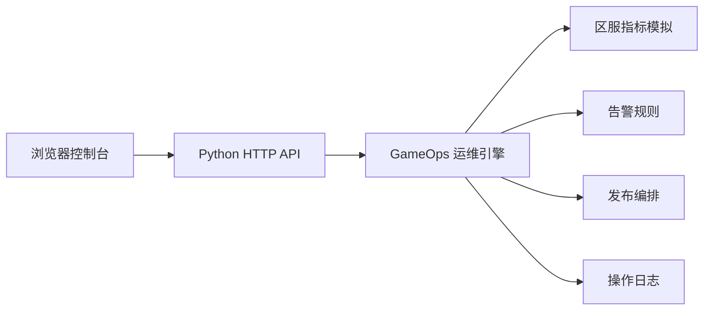

# GameOps Center

GameOps Center 是一个面向游戏业务的运维开发项目，用来模拟游戏服务器的日常运维场景：区服监控、容量水位、实时告警、版本发布、服务器重启、流量权重调整和操作日志追踪。

项目目标不是做一个普通管理页面，而是把“游戏业务”和“运维开发”结合起来：前端提供可视化控制台，后端提供 API 和运维规则引擎，整体可以作为课程项目、简历项目或后续扩展到真实云原生运维平台的基础。

## 项目亮点

- 游戏业务语义明确：区服、战区、排位竞技、团队副本、匹配服务、在线玩家、容量上限。
- 运维场景完整：监控、告警、发布、重启、流量调度、日志审计。
- 无第三方运行依赖：后端使用 Python 标准库，前端使用原生 HTML/CSS/JavaScript。
- 可交互控制台：支持筛选区服、执行发布、重启服务器、调整战区流量权重。
- 可测试核心逻辑：后端运维引擎有单元测试覆盖，方便说明工程质量。

## 技术栈

| 层级 | 技术 | 说明 |
| --- | --- | --- |
| 后端 | Python 标准库 | 使用 `http.server` 提供 API 和静态资源服务 |
| 运维逻辑 | Python | 模拟指标波动、告警规则、发布策略、日志记录 |
| 前端 | HTML/CSS/JavaScript | 原生页面，无构建工具依赖 |
| 可视化 | Canvas | 绘制在线玩家和 P95 延迟趋势 |
| 测试 | unittest | 覆盖发布、重启、流量调整、参数校验 |

## 系统架构



## 功能模块

### 1. 运维总览

控制台顶部展示核心运行状态：

- 在线玩家总数
- 总容量与容量使用率
- 健康节点数量
- 活跃告警数量
- 平均 CPU、平均内存、平均 P95 延迟

这些指标会随着 API 刷新产生轻微波动，用来模拟真实游戏业务中的实时状态变化。

### 2. 游戏区服状态

区服表格展示每台游戏服务器的运行信息：

- 服务器名称与实例 ID
- 所属游戏模式
- 当前玩家数与容量上限
- CPU 使用率
- 内存使用率
- P95 延迟
- 当前版本号
- 运行状态

支持按战区和运行状态筛选，方便快速定位异常区服。

### 3. 实时告警

后端根据阈值自动生成告警。当前规则包括：

| 指标 | Warning 阈值 | Critical 阈值 | 运维建议 |
| --- | ---: | ---: | --- |
| CPU | 75% | 85% | 扩容游戏服或降低匹配入口权重 |
| 内存 | 82% | 90% | 检查房间对象泄漏并滚动重启 |
| P95 延迟 | 130ms | 180ms | 排查跨区路由和战斗同步耗时 |
| 丢包率 | 1% | 3% | 检查边缘节点和 UDP 网关链路 |
| 容量水位 | 92% | 97% | 开启备用区服并调整匹配权重 |

### 4. 发布编排

控制台支持三种发布策略：

| 策略 | 适用场景 | 行为 |
| --- | --- | --- |
| 金丝雀 | 新版本小流量验证 | 只更新一部分目标服务器 |
| 滚动发布 | 常规版本发布 | 更新目标战区内可发布服务器 |
| 故障热修 | 异常服务快速修复 | 优先更新降级服务器 |

发布成功后会写入发布记录和操作日志，并更新目标服务器版本号。

### 5. 运维动作

当前支持两类常见操作：

- 重启服务器：将目标服务器恢复为 `running`，重置运行时长，并降低 CPU、内存、延迟等指标。
- 调整流量权重：对战区进行 `+5` 或 `-5` 的权重调整，模拟入口路由调度。

### 6. 日志中心

日志中心记录发布、告警、流量路由、网关等事件。支持按级别筛选：

- `INFO`
- `WARN`
- `ERROR`

## 快速运行

克隆仓库：

```powershell
git clone https://github.com/ljwei-stak/gameops-center.git
cd gameops-center
```

启动服务：

```powershell
python app.py
```

浏览器访问：

```text
http://127.0.0.1:8018
```

如果默认端口被占用，可以指定其他端口：

```powershell
python app.py 8020
```

## 运行测试

```powershell
python -m unittest discover -s tests
```

预期结果：

```text
Ran 6 tests
OK
```

## API 列表

| 方法 | 路径 | 说明 |
| --- | --- | --- |
| GET | `/api/health` | 服务健康检查 |
| GET | `/api/overview` | 获取总览指标、战区汇总和趋势数据 |
| GET | `/api/servers` | 获取服务器列表，支持 `region` 和 `status` 查询 |
| GET | `/api/alerts` | 获取当前实时告警 |
| GET | `/api/logs` | 获取日志，支持 `level` 和 `limit` 查询 |
| GET | `/api/deployments` | 获取发布记录 |
| POST | `/api/deploy` | 执行版本发布 |
| POST | `/api/servers/{server_id}/restart` | 重启指定服务器 |
| POST | `/api/traffic` | 调整战区流量权重 |

## API 示例

获取总览：

```powershell
Invoke-RestMethod http://127.0.0.1:8018/api/overview
```

查询华东战区服务器：

```powershell
Invoke-RestMethod "http://127.0.0.1:8018/api/servers?region=cn-east"
```

发布版本：

```powershell
Invoke-RestMethod `
  -Method Post `
  -Uri http://127.0.0.1:8018/api/deploy `
  -ContentType 'application/json' `
  -Body '{"region":"cn-east","version":"v1.9.0","strategy":"canary","operator":"ops-admin"}'
```

重启服务器：

```powershell
Invoke-RestMethod `
  -Method Post `
  -Uri http://127.0.0.1:8018/api/servers/cn-north-arena-01/restart `
  -ContentType 'application/json' `
  -Body '{"operator":"ops-admin"}'
```

调整战区流量：

```powershell
Invoke-RestMethod `
  -Method Post `
  -Uri http://127.0.0.1:8018/api/traffic `
  -ContentType 'application/json' `
  -Body '{"region":"cn-east","delta":5,"operator":"ops-admin"}'
```

## 项目结构

```text
gameops-center/
  app.py
  gameops/
    __init__.py
    data.py
    engine.py
  web/
    index.html
    styles.css
    app.js
  tests/
    test_engine.py
  README.md
```

核心文件说明：

| 文件 | 作用 |
| --- | --- |
| `app.py` | HTTP API、静态资源服务、请求路由 |
| `gameops/data.py` | 战区、服务器、初始日志等模拟数据 |
| `gameops/engine.py` | 指标模拟、告警生成、发布策略、运维动作 |
| `web/index.html` | 控制台页面结构 |
| `web/styles.css` | 控制台布局和视觉样式 |
| `web/app.js` | 前端 API 调用、页面渲染、按钮交互 |
| `tests/test_engine.py` | 后端核心逻辑单元测试 |

## 演示流程

可以按下面流程展示项目：

1. 启动服务并打开控制台。
2. 查看顶部总览指标，说明在线玩家、容量、健康节点和告警数量。
3. 在区服表格中筛选某个战区，观察 CPU、内存、延迟和版本号。
4. 查看实时告警，说明阈值和对应运维建议。
5. 执行一次金丝雀发布，观察发布记录和服务器版本变化。
6. 对异常服务器执行重启，观察状态和日志变化。
7. 调整某个战区流量权重，说明入口流量调度思路。

## 可扩展方向

- 接入 Prometheus：暴露 `/metrics`，将模拟指标替换为真实采集指标。
- 接入 Docker：把重启动作改成容器重启，把发布动作改成镜像版本切换。
- 接入 Kubernetes：把区服抽象成 Deployment、Pod、Service，实现滚动发布和扩缩容。
- 增加数据库：用 SQLite、MySQL 或 PostgreSQL 持久化告警、日志和发布记录。
- 增加登录与 RBAC：区分管理员、发布负责人、只读观察员。
- 增加通知渠道：对接企业微信、钉钉、邮件或 Webhook。
- 增加 CI/CD：提交代码后自动运行测试并部署到服务器。

## 项目定位说明

这个项目适合作为运维开发方向的入门到中级项目。它不只是展示页面，而是体现了几个核心能力：

- 能把业务对象抽象成运维对象。
- 能设计简单清晰的后端 API。
- 能实现指标、告警和操作日志之间的联动。
- 能把发布和故障处理流程做成可交互工具。
- 能用测试保障核心运维逻辑。

