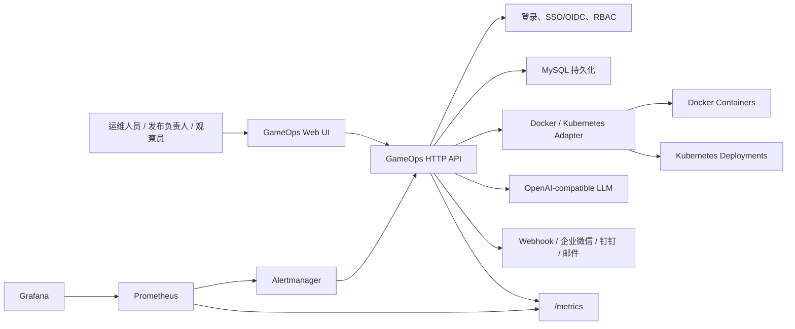

# GameOps Center

GameOps Center 是一个面向游戏区服的自动化运维平台示例项目。它把游戏区服抽象成 CMDB 资产和 Kubernetes `Deployment / Pod / Service` 工作负载，提供监控、告警、发布审批、滚动发布、扩缩容、回滚、通知、RBAC、SSO/OIDC、AI 运维辅助和 CI/CD 示例。

这个项目适合用来演示一套成熟运维平台的端到端骨架，也可以作为继续接入真实云资源、托管 MySQL、Prometheus/Grafana/Alertmanager、Kubernetes 集群和企业 SSO 的起点。

## 功能概览

- CMDB：记录区服、区域、Deployment、Service、容器镜像、容量、负责人和运行指标。
- 真实指标采集：采集宿主机、Docker、Kubernetes 工作负载指标，并暴露 Prometheus `/metrics`。
- Docker 运维：重启动作映射为 `docker restart`，发布动作映射为镜像拉取和容器版本切换。
- Kubernetes 运维：区服抽象为 `Deployment / Pod / Service`，支持 `rollout restart`、`set image`、`scale`、滚动发布和扩缩容。
- MySQL 持久化：告警、日志、发布记录、审批记录、回滚记录、用户会话和指标历史写入 MySQL。
- Migration：同时提供 Alembic 和 Flyway 迁移脚本，生产环境应在发布前执行迁移。
- 登录与 RBAC：内置管理员、发布负责人、只读观察员三类角色；生产环境支持 SSO/OIDC。
- 发布治理：发布先创建审批单，管理员审批后由发布负责人执行；支持变更窗口校验和回滚记录。
- 通知渠道：支持通用 Webhook、企业微信、钉钉和邮件。
- 长期可观测性：Prometheus 负责指标抓取和规则计算，Grafana 自动装载仪表盘，Alertmanager 负责告警路由。
- AI 运维：支持 OpenAI-compatible Chat API 生成诊断、操作日志和日报；无密钥时自动使用本地规则兜底。
- CI/CD：GitHub Actions 自动运行迁移校验、Prometheus 规则校验、单元测试、镜像构建，并可选 SSH 部署。

## 架构



## 目录结构

```text
.
├── app.py                         # HTTP API 和静态页面入口
├── gameops/                       # 核心逻辑：引擎、存储、采集器、适配器、通知、AI
├── web/                           # 前端页面、样式和交互脚本
├── deploy/
│   ├── docker/docker-compose.yml  # 本地完整栈：MySQL、GameOps、Prometheus、Grafana、Alertmanager
│   ├── kubernetes/                # K8s 部署清单、示例业务负载、可信运行时补丁
│   ├── prometheus/                # Prometheus 抓取配置和告警规则
│   ├── grafana/                   # Grafana 数据源和仪表盘 provisioning
│   ├── alertmanager/              # Alertmanager 路由配置
│   └── mysql/                     # 托管 MySQL 环境变量示例
├── migrations/
│   ├── alembic/                   # Alembic 迁移
│   └── flyway/sql/                # Flyway SQL 迁移
├── ops/
│   ├── ansible/                   # Ansible 部署示例
│   └── backup/mysql-backup.ps1    # MySQL 备份脚本
├── infrastructure/terraform/      # Terraform 本地资源供给示例
├── tests/                         # 单元测试和 MySQL 集成测试
└── .github/workflows/ci-cd.yml    # CI/CD 流水线
```

## 运行要求

本地 Docker Compose 方式最省事，推荐先用它跑通完整链路。

| 组件 | 版本建议 | 用途 |
| --- | --- | --- |
| Docker Desktop | 当前稳定版 | 运行 MySQL、GameOps、Prometheus、Grafana、Alertmanager |
| Docker Engine | 24+ | Linux 服务器运行 Compose 栈 |
| Python | 3.12+ | 本地开发、测试、迁移 |
| MySQL | 8.0+ / 8.4 | 持久化数据，Compose 默认使用 `mysql:8.4` |
| Node.js | 18+ | 可选，用于检查前端 JS 语法 |
| kubectl | 与集群匹配 | Kubernetes 运维动作和部署 |
| Alembic | requirements.txt 安装 | Python migration |
| Flyway | 可选 | SQL migration |

## 快速启动：Docker Compose 完整栈

进入项目目录：

```powershell
cd E:\program_file\Shell_project\gameops-center
```

启动完整栈：

```powershell
docker compose -f deploy/docker/docker-compose.yml up -d --build
```

查看容器状态：

```powershell
docker ps --format "table {{.Names}}\t{{.Status}}\t{{.Ports}}"
```

默认访问地址：

| 服务 | 地址 | 说明 |
| --- | --- | --- |
| GameOps Center | http://127.0.0.1:8018 | 运维平台 Web UI |
| GameOps Health | http://127.0.0.1:8018/api/health | 健康检查 |
| GameOps Metrics | http://127.0.0.1:8018/metrics | Prometheus 指标 |
| Prometheus | http://127.0.0.1:9090 | 指标抓取、长期存储、告警规则 |
| Grafana | http://127.0.0.1:3000 | 默认账号 `admin/admin` |
| Alertmanager | http://127.0.0.1:9093 | 告警路由和抑制 |
| MySQL | `127.0.0.1:3307` | 默认库 `gameops` |

默认登录账号只用于本地演示：

| 用户名 | 密码 | 角色 | 权限 |
| --- | --- | --- | --- |
| `admin` | `admin123` | 管理员 | 读取、发布、审批、执行、回滚、重启、扩缩容、流量、通知、AI、用户 |
| `release` | `release123` | 发布负责人 | 读取、创建发布、执行已审批发布、重启、扩缩容、流量、AI |
| `viewer` | `viewer123` | 只读观察员 | 读取 |

生产环境必须关闭本地密码登录并接入 SSO/OIDC，见下文“SSO/OIDC 与 RBAC”。

停止服务：

```powershell
docker compose -f deploy/docker/docker-compose.yml down
```

如果需要同时删除本地数据卷：

```powershell
docker compose -f deploy/docker/docker-compose.yml down -v
```

## Linux / WSL 部署与使用

Linux 下推荐优先使用 Docker Compose 完整栈部署；如果你要把 GameOps 作为普通 Python 服务运行，也可以使用系统 MySQL 或托管 MySQL。WSL 场景则通常复用 Windows 上的 Docker Desktop。

### Linux 服务器 Docker Compose 部署

以下命令以 Ubuntu / Debian 为例。生产服务器建议创建独立用户运行项目，例如 `gameops`。

安装基础工具：

```bash
sudo apt update
sudo apt install -y git curl ca-certificates
```

安装 Docker Engine 和 Compose plugin。若服务器已经安装 Docker，可跳过这一段：

```bash
sudo install -m 0755 -d /etc/apt/keyrings
curl -fsSL https://download.docker.com/linux/ubuntu/gpg \
  | sudo gpg --dearmor -o /etc/apt/keyrings/docker.gpg
sudo chmod a+r /etc/apt/keyrings/docker.gpg

. /etc/os-release
echo \
  "deb [arch=$(dpkg --print-architecture) signed-by=/etc/apt/keyrings/docker.gpg] https://download.docker.com/linux/ubuntu \
  ${VERSION_CODENAME} stable" \
  | sudo tee /etc/apt/sources.list.d/docker.list >/dev/null

sudo apt update
sudo apt install -y docker-ce docker-ce-cli containerd.io docker-buildx-plugin docker-compose-plugin
```

允许当前用户直接运行 Docker：

```bash
sudo usermod -aG docker "$USER"
newgrp docker
docker version
docker compose version
```

拉取项目并启动完整栈：

```bash
git clone https://github.com/ljwei-stak/gameops-center.git
cd gameops-center
docker compose -f deploy/docker/docker-compose.yml up -d --build
```

查看运行状态：

```bash
docker ps --format "table {{.Names}}\t{{.Status}}\t{{.Ports}}"
curl -s http://127.0.0.1:8018/api/health
curl -s http://127.0.0.1:8018/metrics | grep gameops_mysql_pool_idle
```

服务器防火墙只开放你需要的入口。最小本地验证通常只需要 SSH；如果要从外部访问 Web UI 和 Grafana，再按需开放：

| 端口 | 服务 | 建议 |
| --- | --- | --- |
| `8018` | GameOps Center | 建议放在反向代理后，并启用 HTTPS |
| `3000` | Grafana | 生产环境必须修改默认密码 |
| `9090` | Prometheus | 不建议直接暴露公网 |
| `9093` | Alertmanager | 不建议直接暴露公网 |
| `3307` | MySQL 映射端口 | 生产环境不要暴露公网 |

常用运维命令：

```bash
docker compose -f deploy/docker/docker-compose.yml logs -f gameops-center
docker compose -f deploy/docker/docker-compose.yml restart gameops-center
docker compose -f deploy/docker/docker-compose.yml pull
docker compose -f deploy/docker/docker-compose.yml up -d --build
docker compose -f deploy/docker/docker-compose.yml down
```

升级代码并重启：

```bash
git pull
docker compose -f deploy/docker/docker-compose.yml run --rm gameops-center \
  sh -lc "cd /app && alembic -c migrations/alembic.ini upgrade head"
docker compose -f deploy/docker/docker-compose.yml up -d --build
```

### Linux 原生 Python 服务部署

如果不想把应用本体放进容器，可以用 Linux 原生 Python 跑 GameOps，数据库使用本机 MySQL 或托管 MySQL。

安装依赖：

```bash
sudo apt update
sudo apt install -y python3 python3-pip python3-venv git mysql-client
```

创建虚拟环境：

```bash
git clone https://github.com/ljwei-stak/gameops-center.git
cd gameops-center
python3 -m venv .venv
. .venv/bin/activate
python -m pip install --upgrade pip
python -m pip install -r requirements.txt
```

配置环境变量：

```bash
export GAMEOPS_MYSQL_HOST="127.0.0.1"
export GAMEOPS_MYSQL_PORT="3306"
export GAMEOPS_MYSQL_DATABASE="gameops"
export GAMEOPS_MYSQL_USER="gameops"
export GAMEOPS_MYSQL_PASSWORD="gameops-pass"
export GAMEOPS_HOST="0.0.0.0"
export GAMEOPS_RUNTIME="auto"
export GAMEOPS_DRY_RUN="true"
export GAMEOPS_TRUSTED_RUNTIME="false"
```

初始化数据库：

```bash
mysql -h "$GAMEOPS_MYSQL_HOST" -P "$GAMEOPS_MYSQL_PORT" -uroot -p <<'SQL'
CREATE DATABASE IF NOT EXISTS gameops CHARACTER SET utf8mb4 COLLATE utf8mb4_unicode_ci;
CREATE USER IF NOT EXISTS 'gameops'@'%' IDENTIFIED BY 'gameops-pass';
GRANT ALL PRIVILEGES ON gameops.* TO 'gameops'@'%';
FLUSH PRIVILEGES;
SQL

alembic -c migrations/alembic.ini upgrade head
```

启动应用：

```bash
python app.py 8018
```

用 systemd 托管服务。先创建环境文件：

```bash
sudo tee /etc/gameops-center.env >/dev/null <<'EOF'
GAMEOPS_MYSQL_HOST=127.0.0.1
GAMEOPS_MYSQL_PORT=3306
GAMEOPS_MYSQL_DATABASE=gameops
GAMEOPS_MYSQL_USER=gameops
GAMEOPS_MYSQL_PASSWORD=gameops-pass
GAMEOPS_HOST=0.0.0.0
GAMEOPS_RUNTIME=auto
GAMEOPS_DRY_RUN=true
GAMEOPS_TRUSTED_RUNTIME=false
GAMEOPS_LOCAL_LOGIN_ENABLED=true
EOF
```

再创建 systemd unit，注意把 `User` 和路径改成你的实际部署用户和目录：

```bash
sudo tee /etc/systemd/system/gameops-center.service >/dev/null <<'EOF'
[Unit]
Description=GameOps Center
After=network-online.target mysql.service
Wants=network-online.target

[Service]
Type=simple
User=gameops
WorkingDirectory=/opt/gameops-center
EnvironmentFile=/etc/gameops-center.env
ExecStart=/opt/gameops-center/.venv/bin/python /opt/gameops-center/app.py 8018
Restart=always
RestartSec=5

[Install]
WantedBy=multi-user.target
EOF

sudo systemctl daemon-reload
sudo systemctl enable --now gameops-center
sudo systemctl status gameops-center
```

查看日志：

```bash
journalctl -u gameops-center -f
```

### WSL + Docker Desktop 使用

WSL 适合本机开发和测试。推荐做法是：代码放在 Windows 工作区或 WSL home 均可，容器由 Windows 的 Docker Desktop 承载，WSL 里通过 Docker Desktop WSL Integration 或 Windows interop 调用同一套 Docker 后端。

在 Docker Desktop 图形界面中启用 Ubuntu integration：

```text
Docker Desktop -> Settings -> Resources -> WSL Integration -> Enable integration with Ubuntu
```

重新打开 Ubuntu 终端后验证：

```bash
docker --version
docker compose version
docker desktop status
```

Docker Desktop 4.37+ 提供 `docker desktop` 子命令，可以从 WSL 里管理 Docker Desktop 应用本身：

```bash
docker desktop start
docker desktop stop
docker desktop restart
docker desktop status
docker desktop version
```

如果 WSL Integration 还没有注入 `docker` 命令，但 WSL interop 已开启，也可以直接调用 Windows 端可执行文件：

```bash
docker.exe desktop status
docker.exe desktop start
docker.exe ps
docker.exe compose version
```

或者使用完整路径：

```bash
"/mnt/c/Program Files/Docker/Docker/resources/bin/docker.exe" desktop status
"/mnt/c/Program Files/Docker/Docker/resources/bin/docker.exe" compose version
"/mnt/c/Program Files/Docker/Docker/Docker Desktop.exe" &
```

在 WSL 中进入当前 Windows 工作区：

```bash
cd /mnt/e/program_file/Shell_project/gameops-center
```

安装 Python 测试环境：

```bash
sudo apt update
sudo apt install -y python3-pip python3-venv
python3 -m venv ~/.venvs/gameops-center
. ~/.venvs/gameops-center/bin/activate
python -m pip install --upgrade pip
python -m pip install -r requirements.txt
```

启动 Compose 栈：

```bash
docker compose -f deploy/docker/docker-compose.yml up -d --build
```

如果使用 `docker.exe`，命令等价：

```bash
docker.exe compose -f deploy/docker/docker-compose.yml up -d --build
```

WSL 中验证服务：

```bash
curl -s http://127.0.0.1:8018/api/health
curl -s http://127.0.0.1:8018/metrics | grep gameops_workload_cpu_percent
curl -s http://127.0.0.1:9090/api/v1/targets
curl -s http://127.0.0.1:3000/api/health
curl -s http://127.0.0.1:9093/-/ready
```

WSL 中运行测试：

```bash
. ~/.venvs/gameops-center/bin/activate
python -m unittest discover -s tests
```

启用 MySQL 集成测试：

```bash
export GAMEOPS_TEST_MYSQL=1
export GAMEOPS_MYSQL_HOST=127.0.0.1
export GAMEOPS_MYSQL_PORT=3307
export GAMEOPS_MYSQL_USER=gameops
export GAMEOPS_MYSQL_PASSWORD=gameops-pass
export GAMEOPS_MYSQL_ROOT_USER=root
export GAMEOPS_MYSQL_ROOT_PASSWORD=root-pass
python -m unittest discover -s tests
```

WSL 中常见注意事项：

- 如果 `docker` 提示没有 WSL Integration，先确认 Docker Desktop UI 中 Ubuntu integration 已开启。
- 如果 `docker desktop status` 可用但 `docker` 不可用，可以临时用 `docker.exe`。
- 如果 Ubuntu 终端启动异常，可执行 `wsl --terminate Ubuntu` 后重新打开。
- Windows 路径在 WSL 中通常映射为 `/mnt/c`、`/mnt/d`、`/mnt/e`。
- 在 `/mnt/*` 下运行 Git 时，可能出现换行符或 filemode 差异；提交前建议以 Windows Git 或统一的 Git 配置确认状态。

## 本地开发运行

如果你已经安装好 MySQL，也可以不用 Docker 跑应用本体。

创建数据库和用户，示例 SQL：

```sql
CREATE DATABASE IF NOT EXISTS gameops CHARACTER SET utf8mb4 COLLATE utf8mb4_unicode_ci;
CREATE USER IF NOT EXISTS 'gameops'@'%' IDENTIFIED BY 'gameops-pass';
GRANT ALL PRIVILEGES ON gameops.* TO 'gameops'@'%';
FLUSH PRIVILEGES;
```

安装依赖：

```powershell
cd E:\program_file\Shell_project\gameops-center
python -m pip install -r requirements.txt
```

配置环境变量：

```powershell
$env:GAMEOPS_MYSQL_HOST="127.0.0.1"
$env:GAMEOPS_MYSQL_PORT="3306"
$env:GAMEOPS_MYSQL_DATABASE="gameops"
$env:GAMEOPS_MYSQL_USER="gameops"
$env:GAMEOPS_MYSQL_PASSWORD="gameops-pass"
$env:GAMEOPS_HOST="127.0.0.1"
$env:GAMEOPS_RUNTIME="auto"
$env:GAMEOPS_DRY_RUN="true"
$env:GAMEOPS_TRUSTED_RUNTIME="false"
```

执行数据库迁移：

```powershell
alembic -c migrations/alembic.ini upgrade head
```

启动应用：

```powershell
python app.py 8018
```

访问：

```text
http://127.0.0.1:8018
```

## MySQL 配置

应用启动时会读取以下变量：

| 变量 | 默认值 | 说明 |
| --- | --- | --- |
| `GAMEOPS_MYSQL_HOST` | `127.0.0.1` | MySQL 地址 |
| `GAMEOPS_MYSQL_PORT` | `3306` | MySQL 端口 |
| `GAMEOPS_MYSQL_DATABASE` | `gameops` | 数据库名 |
| `GAMEOPS_MYSQL_USER` | `gameops` | 应用用户 |
| `GAMEOPS_MYSQL_PASSWORD` | `gameops-pass` | 应用密码 |
| `GAMEOPS_MYSQL_MANAGED` | 空 | 设为 `true` 表示托管 MySQL，用于指标和告警判断 |
| `GAMEOPS_MYSQL_POOL_SIZE` | `5` | 应用侧连接池空闲连接上限 |
| `GAMEOPS_MYSQL_CONNECT_TIMEOUT` | `8` | 连接超时秒数 |
| `GAMEOPS_MYSQL_READ_TIMEOUT` | `15` | 读取超时秒数 |
| `GAMEOPS_MYSQL_WRITE_TIMEOUT` | `15` | 写入超时秒数 |
| `GAMEOPS_MYSQL_SLOW_QUERY_SECONDS` | `1.0` | 应用侧慢操作统计阈值 |

Compose 中 MySQL 发布到宿主机的默认端口是 `3307`。如需修改：

```powershell
$env:GAMEOPS_MYSQL_PUBLISHED_PORT="3308"
docker compose -f deploy/docker/docker-compose.yml up -d
```

生产建议使用托管 MySQL。可从示例配置开始：

```powershell
Get-Content deploy/mysql/managed-mysql.example.env
```

生产侧建议：

- 开启自动备份和 PITR，备份保留至少 7 天。
- 开启慢查询日志，并接入云厂商日志服务。
- 应用用户和迁移用户分离，最小权限授权。
- 远程连接强制 TLS。
- 通过 `/metrics` 监控连接池、连接溢出和慢操作计数。

手动备份示例：

```powershell
$env:GAMEOPS_MYSQL_HOST="prod-mysql.example.com"
$env:GAMEOPS_MYSQL_PORT="3306"
$env:GAMEOPS_MYSQL_DATABASE="gameops"
$env:GAMEOPS_MYSQL_USER="gameops_backup"
$env:GAMEOPS_MYSQL_PASSWORD="change-me"
.\ops\backup\mysql-backup.ps1 -OutputDir .\backups
```

## 数据库迁移

本项目提供两套迁移方式，生产环境任选一套作为正式流程，不建议混用。

Alembic：

```powershell
$env:GAMEOPS_MYSQL_HOST="127.0.0.1"
$env:GAMEOPS_MYSQL_PORT="3306"
$env:GAMEOPS_MYSQL_DATABASE="gameops"
$env:GAMEOPS_MYSQL_USER="gameops"
$env:GAMEOPS_MYSQL_PASSWORD="gameops-pass"
alembic -c migrations/alembic.ini upgrade head
```

Flyway：

```powershell
flyway `
  -url="jdbc:mysql://$env:GAMEOPS_MYSQL_HOST:$env:GAMEOPS_MYSQL_PORT/$env:GAMEOPS_MYSQL_DATABASE" `
  -user="$env:GAMEOPS_MYSQL_USER" `
  -password="$env:GAMEOPS_MYSQL_PASSWORD" `
  -locations="filesystem:migrations/flyway/sql" `
  migrate
```

说明：

- 本地演示时应用仍有幂等建表逻辑，方便第一次启动。
- 生产环境应在应用发布前由 CI/CD 或 DBA 流程执行 migration。
- 推荐给 migration 单独配置更高权限账号，应用运行账号只保留日常读写权限。

## Docker 运维模式

Docker 模式下，区服工作负载会映射为容器操作：

| GameOps 动作 | Docker 行为 |
| --- | --- |
| 重启工作负载 | `docker restart <container>` |
| 发布版本 | `docker pull <image>` 后删除旧容器并运行新镜像 |
| 扩容 | 按副本数启动更多容器 |
| 缩容 | 删除多余容器 |

启用 Docker 模式：

```powershell
$env:GAMEOPS_RUNTIME="docker"
$env:GAMEOPS_DRY_RUN="true"
$env:GAMEOPS_TRUSTED_RUNTIME="false"
docker compose -f deploy/docker/docker-compose.yml up -d --build
```

默认是 dry-run，不会真正执行危险操作。要让应用执行真实 Docker 命令，必须同时设置：

```powershell
$env:GAMEOPS_DRY_RUN="false"
$env:GAMEOPS_TRUSTED_RUNTIME="true"
$env:GAMEOPS_RUNTIME="docker"
```

请只在可信环境中这样配置，并确保 Docker socket 权限不会扩大到不该拥有运维权限的用户。

## Kubernetes 部署

Kubernetes 模式下，GameOps 将区服抽象为 `Deployment / Pod / Service`：

| GameOps 对象 | Kubernetes 对象 |
| --- | --- |
| 区域 | 业务区域和流量权重 |
| 工作负载 | `Deployment` |
| Pod 数 | `Deployment.spec.replicas` |
| 发布版本 | 容器镜像 tag |
| 访问入口 | `Service` |

应用清单：

```text
deploy/kubernetes/gameops-center.yaml
```

示例业务负载：

```text
deploy/kubernetes/sample-game-workloads.yaml
```

部署命令示例：

```powershell
kubectl apply -f deploy/kubernetes/gameops-center.yaml
kubectl apply -f deploy/kubernetes/sample-game-workloads.yaml
```

配置密钥：

```powershell
kubectl -n gameops create secret generic gameops-secrets `
  --from-literal=mysql-password="change-me" `
  --from-literal=llm-api-key="" `
  --dry-run=client -o yaml | kubectl apply -f -
```

查看状态：

```powershell
kubectl -n gameops get deploy,pod,svc
kubectl -n game-prod get deploy,pod,svc
```

端口转发访问：

```powershell
kubectl -n gameops port-forward svc/gameops-center 8018:8018
```

Kubernetes 运维动作：

| GameOps 动作 | kubectl 行为 |
| --- | --- |
| 重启 | `kubectl rollout restart deployment/<name> -n <namespace>` |
| 发布 | `kubectl set image deployment/<name> <container>=<image> -n <namespace>` |
| 发布等待 | `kubectl rollout status deployment/<name> -n <namespace>` |
| 扩缩容 | `kubectl scale deployment/<name> --replicas=<n> -n <namespace>` |

默认清单使用 namespace 级别最小权限 RBAC：

- GameOps 运行在 `gameops` namespace。
- 只对 `game-prod` namespace 中的 `pods`、`services`、`deployments`、`deployments/scale` 授权。
- 不使用 cluster-wide 权限。

默认仍是 dry-run：

```yaml
GAMEOPS_DRY_RUN: "true"
GAMEOPS_TRUSTED_RUNTIME: "false"
```

只有在确认 ServiceAccount、namespace、审计、审批流程都符合生产要求后，才应用可信运行时补丁：

```powershell
kubectl apply -f deploy/kubernetes/trusted-runtime-patch.yaml
```

## 发布、审批和回滚

发布流程不是直接执行，而是先创建审批单：

1. 发布负责人创建发布申请。
2. 管理员审批或拒绝。
3. 发布负责人执行已审批发布。
4. 系统校验版本号、变更窗口和目标工作负载。
5. Docker 或 Kubernetes adapter 执行镜像切换。
6. 发布记录、操作日志和通知结果写入 MySQL。
7. 如需恢复，可对发布记录执行回滚，并写入回滚记录。

版本号格式必须为：

```text
v主版本.次版本.修订号
```

例如：

```text
v1.9.0
```

变更窗口格式：

```text
HH:MM-HH:MM
```

例如：

```text
01:00-05:00
```

全局变更窗口：

```powershell
$env:GAMEOPS_CHANGE_WINDOW="01:00-05:00"
```

创建发布申请的 API 示例：

```powershell
$token = "<login-token>"
$headers = @{ Authorization = "Bearer $token"; "Content-Type" = "application/json" }
$body = @{
  region = "cn-east"
  version = "v1.9.0"
  strategy = "canary"
  image = "registry.example.com/game/arena:v1.9.0"
  reason = "修复匹配延迟"
  change_window = "01:00-05:00"
} | ConvertTo-Json

Invoke-RestMethod -Method POST -Uri "http://127.0.0.1:8018/api/deploy" -Headers $headers -Body $body
```

审批：

```powershell
Invoke-RestMethod -Method POST `
  -Uri "http://127.0.0.1:8018/api/deploy/approvals/APR-2401/approve" `
  -Headers $headers `
  -Body (@{ approved = $true; reason = "窗口内发布" } | ConvertTo-Json)
```

执行：

```powershell
Invoke-RestMethod -Method POST `
  -Uri "http://127.0.0.1:8018/api/deploy/approvals/APR-2401/execute" `
  -Headers $headers `
  -Body (@{} | ConvertTo-Json)
```

回滚：

```powershell
Invoke-RestMethod -Method POST `
  -Uri "http://127.0.0.1:8018/api/deployments/DEP-2401/rollback" `
  -Headers $headers `
  -Body (@{ reason = "发布后错误率升高" } | ConvertTo-Json)
```

## 日常使用

Web UI 常用入口：

- 总览：查看在线人数、告警、容量、延迟、主机指标和趋势。
- 区服：按区域、状态筛选工作负载。
- 告警：查看当前活跃告警。
- 日志：按级别查看操作日志、告警日志和系统日志。
- 发布：创建发布申请、审批、执行、查看发布历史。
- 回滚：查看回滚记录。
- CMDB：查看区域、区服、Deployment、Service、镜像和容量关系。
- AI：生成故障诊断和运维报告。
- Metrics：跳转 `/metrics` 原始指标。

典型流程：

1. 登录。
2. 在总览页确认当前风险。
3. 查看告警和区服指标。
4. 对异常区服执行重启、扩容或流量调整。
5. 创建发布申请，等待审批。
6. 在变更窗口内执行发布。
7. 观察 Prometheus/Grafana 指标和 Alertmanager 告警。
8. 如有异常，对发布记录执行回滚。
9. 使用 AI 生成诊断或日报，辅助复盘。

## API 参考

所有需要登录的 API 使用 Bearer Token：

```text
Authorization: Bearer <token>
```

| 方法 | 路径 | 权限 | 说明 |
| --- | --- | --- | --- |
| `GET` | `/` | 无 | Web UI |
| `GET` | `/api/health` | 无 | 健康检查 |
| `GET` | `/metrics` | 无 | Prometheus 指标 |
| `POST` | `/api/login` | 无 | 本地账号登录 |
| `POST` | `/api/sso/login` | 无 | OIDC ID Token 登录 |
| `POST` | `/api/logout` | 登录 | 退出登录 |
| `GET` | `/api/me` | 可选 | 当前用户 |
| `GET` | `/api/overview` | read | 总览 |
| `GET` | `/api/cmdb` | read | CMDB |
| `GET` | `/api/workloads` | read | 工作负载列表，支持 `region`、`status` |
| `GET` | `/api/servers` | read | 兼容旧接口，等同 workloads |
| `GET` | `/api/alerts` | read | 活跃告警 |
| `GET` | `/api/logs` | read | 日志，支持 `level`、`limit` |
| `GET` | `/api/deployments` | read | 发布记录 |
| `GET` | `/api/deploy/approvals` | read | 发布审批单，支持 `status` |
| `GET` | `/api/rollbacks` | read | 回滚记录 |
| `GET` | `/api/ai/diagnosis` | ai | AI 故障诊断 |
| `GET` | `/api/ai/report` | ai | AI 运维报告 |
| `GET` | `/api/users` | users | 用户列表 |
| `POST` | `/api/deploy` | deploy | 创建发布审批单 |
| `POST` | `/api/deploy/approvals/{id}/approve` | approve_deploy | 审批或拒绝 |
| `POST` | `/api/deploy/approvals/{id}/execute` | execute_deploy | 执行已审批发布 |
| `POST` | `/api/deployments/{id}/rollback` | rollback | 回滚发布 |
| `POST` | `/api/workloads/{id}/restart` | restart | 重启工作负载 |
| `POST` | `/api/workloads/{id}/scale` | scale | 扩缩容 |
| `POST` | `/api/traffic` | traffic | 调整区域流量权重 |
| `POST` | `/api/notify/alerts` | notify | 手动发送当前告警 |
| `POST` | `/api/alertmanager` | 无 | Alertmanager Webhook 接收 |

登录示例：

```powershell
$login = Invoke-RestMethod -Method POST `
  -Uri "http://127.0.0.1:8018/api/login" `
  -ContentType "application/json" `
  -Body (@{ username = "admin"; password = "admin123" } | ConvertTo-Json)

$token = $login.token
```

查询总览：

```powershell
Invoke-RestMethod -Uri "http://127.0.0.1:8018/api/overview" -Headers @{ Authorization = "Bearer $token" }
```

扩容：

```powershell
Invoke-RestMethod -Method POST `
  -Uri "http://127.0.0.1:8018/api/workloads/cn-east-arena/scale" `
  -Headers @{ Authorization = "Bearer $token"; "Content-Type" = "application/json" } `
  -Body (@{ replicas = 4 } | ConvertTo-Json)
```

## Prometheus、Grafana、Alertmanager

Compose 启动后，可观测性栈会自动接管长期指标、仪表盘和告警路由。

Prometheus 配置：

```text
deploy/prometheus/prometheus.yml
```

告警规则：

```text
deploy/prometheus/rules/gameops-alerts.yml
```

Grafana provisioning：

```text
deploy/grafana/provisioning
deploy/grafana/dashboards/gameops-overview.json
```

Alertmanager 配置：

```text
deploy/alertmanager/alertmanager.yml
```

默认抓取目标：

- `gameops-center:8018/metrics`
- `prometheus:9090/metrics`
- `alertmanager:9093/metrics`

默认告警流向：

```text
Prometheus rules -> Alertmanager -> POST /api/alertmanager -> MySQL 日志 -> 通知渠道
```

调整指标保留时间：

```powershell
$env:GAMEOPS_PROMETHEUS_RETENTION="30d"
docker compose -f deploy/docker/docker-compose.yml up -d prometheus
```

校验 Prometheus 配置和规则：

```powershell
docker exec gameops-prometheus promtool check config /etc/prometheus/prometheus.yml
docker exec gameops-prometheus promtool check rules /etc/prometheus/rules/gameops-alerts.yml
```

查看 Prometheus targets：

```powershell
Invoke-RestMethod -Uri "http://127.0.0.1:9090/api/v1/targets"
```

核心指标示例：

| 指标 | 含义 |
| --- | --- |
| `gameops_host_cpu_percent` | 宿主机 CPU 使用率 |
| `gameops_host_memory_percent` | 宿主机内存使用率 |
| `gameops_workload_cpu_percent` | 工作负载 CPU |
| `gameops_workload_memory_percent` | 工作负载内存 |
| `gameops_workload_latency_p95_ms` | 工作负载 P95 延迟 |
| `gameops_alerts_active` | 活跃告警数 |
| `gameops_deployments_total` | 发布总数 |
| `gameops_deployment_approvals_pending` | 待审批发布数 |
| `gameops_rollbacks_total` | 回滚总数 |
| `gameops_mysql_pool_in_use` | MySQL 连接池使用中连接数 |
| `gameops_mysql_pool_idle` | MySQL 连接池空闲连接数 |
| `gameops_mysql_pool_overflow_total` | 连接池溢出次数 |
| `gameops_mysql_slow_queries_total` | 应用侧慢操作次数 |
| `gameops_mysql_managed` | 是否使用托管 MySQL |

## 通知渠道

通知配置全部通过环境变量注入：

```powershell
$env:GAMEOPS_WEBHOOK_URL="https://example.com/webhook"
$env:GAMEOPS_WECOM_WEBHOOK="https://qyapi.weixin.qq.com/cgi-bin/webhook/send?key=..."
$env:GAMEOPS_DINGTALK_WEBHOOK="https://oapi.dingtalk.com/robot/send?access_token=..."
$env:GAMEOPS_SMTP_HOST="smtp.example.com"
$env:GAMEOPS_SMTP_PORT="587"
$env:GAMEOPS_SMTP_USER="ops@example.com"
$env:GAMEOPS_SMTP_PASSWORD="change-me"
$env:GAMEOPS_MAIL_FROM="ops@example.com"
$env:GAMEOPS_MAIL_TO="sre@example.com,release@example.com"
```

发送当前活跃告警：

```powershell
Invoke-RestMethod -Method POST `
  -Uri "http://127.0.0.1:8018/api/notify/alerts" `
  -Headers @{ Authorization = "Bearer $token"; "Content-Type" = "application/json" } `
  -Body (@{} | ConvertTo-Json)
```

Alertmanager 触发的告警会写入日志，并复用这些渠道继续分发。

## AI 大模型配置

AI 能力使用 OpenAI-compatible Chat Completions 接口。没有密钥时，系统会使用本地规则生成诊断和报告，不影响平台运行。

```powershell
$env:GAMEOPS_LLM_API_KEY="sk-..."
$env:GAMEOPS_LLM_API_BASE="https://api.openai.com/v1"
$env:GAMEOPS_LLM_MODEL="gpt-4.1-mini"
$env:GAMEOPS_LLM_USER_AGENT="GameOps-Center/1.0"
```

如果使用第三方兼容网关，例如 NewAPI，通常只需要把 base URL 和模型名换成网关提供的值：

```powershell
$env:GAMEOPS_LLM_API_BASE="https://your-newapi.example/v1"
$env:GAMEOPS_LLM_MODEL="your-model-name"
```

`GAMEOPS_LLM_USER_AGENT` 用于兼容部分网关/WAF 对默认 HTTP 客户端的限制。如果遇到 `403`、`1010` 或类似网关错误，可以先确认：

- base URL 是否包含 `/v1`。
- 模型名是否在网关的 `/v1/models` 中存在。
- 网关是否限制来源 IP 或 User-Agent。
- 密钥是否有 Chat Completions 权限。

不要把真实 API key 写入 README、GitHub、镜像或 Kubernetes ConfigMap。生产环境应使用 GitHub Secrets、Kubernetes Secret 或云厂商 Secret Manager。

## SSO/OIDC 与 RBAC

生产环境建议关闭本地账号：

```powershell
$env:GAMEOPS_LOCAL_LOGIN_ENABLED="false"
```

配置 OIDC：

```powershell
$env:GAMEOPS_OIDC_ISSUER="https://sso.example.com"
$env:GAMEOPS_OIDC_CLIENT_ID="gameops-center"
$env:GAMEOPS_OIDC_JWKS_URL="https://sso.example.com/.well-known/jwks.json"
$env:GAMEOPS_OIDC_ADMIN_GROUP="gameops-admins"
$env:GAMEOPS_OIDC_RELEASE_GROUP="gameops-release"
```

OIDC 角色映射：

| OIDC group | GameOps 角色 |
| --- | --- |
| `GAMEOPS_OIDC_ADMIN_GROUP` | `admin` |
| `GAMEOPS_OIDC_RELEASE_GROUP` | `release_manager` |
| 其他用户 | `observer` |

开发调试可以允许 unsigned dev token：

```powershell
$env:GAMEOPS_OIDC_ALLOW_UNSIGNED_DEV_TOKENS="true"
```

这个变量只能用于开发环境，生产环境不要设置。

RBAC 权限：

| 角色 | 权限 |
| --- | --- |
| `admin` | read、deploy、approve_deploy、execute_deploy、rollback、restart、scale、traffic、notify、ai、users |
| `release_manager` | read、deploy、execute_deploy、restart、scale、traffic、ai |
| `observer` | read |

## IaC 与自动化执行

Terraform 示例位于：

```text
infrastructure/terraform/main.tf
```

运行：

```powershell
cd infrastructure/terraform
terraform init
terraform apply
```

Ansible 示例位于：

```text
ops/ansible/inventory.ini
ops/ansible/deploy-gameops.yml
```

运行：

```powershell
ansible-playbook -i ops/ansible/inventory.ini ops/ansible/deploy-gameops.yml
```

这些示例主要用于展示 IaC 与配置管理接入方式。生产环境应按实际云厂商、网络、安全组、镜像仓库和主机基线调整。

## CI/CD

GitHub Actions 工作流：

```text
.github/workflows/ci-cd.yml
```

触发条件：

- push 到 `main` 或 `master`
- pull request

流水线步骤：

1. 启动 MySQL 8.4 service。
2. 安装 Python 依赖。
3. 执行 Alembic migration。
4. 使用 `promtool` 校验 Prometheus 规则。
5. 运行单元测试和 MySQL 集成测试。
6. push 事件构建 Docker 镜像。
7. 如果启用部署变量，则通过 SSH 部署到服务器。

启用自动部署需要设置仓库变量：

| 类型 | 名称 | 说明 |
| --- | --- | --- |
| GitHub Variable | `ENABLE_GAMEOPS_DEPLOY=true` | 开启 deploy job |
| GitHub Secret | `GAMEOPS_HOST` | 目标服务器地址 |
| GitHub Secret | `GAMEOPS_USER` | SSH 用户 |
| GitHub Secret | `GAMEOPS_SSH_KEY` | SSH 私钥 |

部署脚本会在服务器上执行：

```text
cd /opt/gameops-center
git pull
docker compose -f deploy/docker/docker-compose.yml run --rm gameops-center sh -lc "cd /app && alembic -c migrations/alembic.ini upgrade head"
docker compose -f deploy/docker/docker-compose.yml up -d --build
```

## 测试

运行全部默认测试：

```powershell
python -m unittest discover -s tests
```

默认情况下 MySQL 集成测试会跳过。要启用 MySQL 集成测试：

```powershell
$env:GAMEOPS_TEST_MYSQL="1"
$env:GAMEOPS_MYSQL_HOST="127.0.0.1"
$env:GAMEOPS_MYSQL_PORT="3307"
$env:GAMEOPS_MYSQL_USER="gameops"
$env:GAMEOPS_MYSQL_PASSWORD="gameops-pass"
$env:GAMEOPS_MYSQL_ROOT_USER="root"
$env:GAMEOPS_MYSQL_ROOT_PASSWORD="root-pass"
python -m unittest discover -s tests
```

前端 JS 语法检查：

```powershell
node --check web/app.js
```

Docker Compose 配置检查：

```powershell
docker compose -f deploy/docker/docker-compose.yml config
```

Prometheus 规则检查：

```powershell
docker exec gameops-prometheus promtool check rules /etc/prometheus/rules/gameops-alerts.yml
```

## 生产部署检查清单

上线前建议逐项确认：

- 已使用托管 MySQL，开启备份、PITR、慢查询日志和 TLS。
- 已通过 Alembic 或 Flyway 执行正式 migration。
- 已关闭本地账号：`GAMEOPS_LOCAL_LOGIN_ENABLED=false`。
- 已接入 SSO/OIDC，并完成管理员组、发布组映射。
- 已把真实密钥放入 Secret Manager、GitHub Secrets 或 Kubernetes Secret。
- 已保持 `GAMEOPS_DRY_RUN=true` 完成演练。
- 只有在可信环境中才设置 `GAMEOPS_DRY_RUN=false` 和 `GAMEOPS_TRUSTED_RUNTIME=true`。
- Kubernetes ServiceAccount 使用 namespace 级别最小权限。
- 发布动作启用人工审批、变更窗口和回滚记录。
- Prometheus/Grafana/Alertmanager 已负责长期指标、仪表盘和告警路由。
- Alertmanager 告警已能写入 GameOps 日志并触达通知渠道。
- CI/CD 已在部署前运行测试、迁移校验和 Prometheus 规则校验。
- Docker socket、kubectl kubeconfig、数据库账号都经过最小权限审计。

## 常见排障

### GameOps 启动失败，提示 MySQL 连接失败

检查 MySQL 是否可达：

```powershell
docker ps
docker logs gameops-mysql --tail 100
```

如果使用宿主机 MySQL，确认端口、用户、密码和授权：

```powershell
mysql -h 127.0.0.1 -P 3306 -u gameops -p
```

### 端口被占用

修改 Compose 发布端口：

```powershell
$env:GAMEOPS_MYSQL_PUBLISHED_PORT="3308"
$env:GAMEOPS_PROMETHEUS_PORT="9091"
$env:GAMEOPS_GRAFANA_PORT="3001"
$env:GAMEOPS_ALERTMANAGER_PORT="9094"
docker compose -f deploy/docker/docker-compose.yml up -d
```

### 点了重启、发布或扩缩容，但没有真实执行

检查这两个变量：

```powershell
$env:GAMEOPS_DRY_RUN
$env:GAMEOPS_TRUSTED_RUNTIME
```

真实执行必须满足：

```text
GAMEOPS_DRY_RUN=false
GAMEOPS_TRUSTED_RUNTIME=true
```

同时还要确认运行环境中存在 `docker` 或 `kubectl`，并且权限足够。

### Prometheus target down

查看 target：

```powershell
Invoke-RestMethod -Uri "http://127.0.0.1:9090/api/v1/targets"
```

检查容器网络和应用健康：

```powershell
docker ps
Invoke-RestMethod -Uri "http://127.0.0.1:8018/api/health"
```

### Grafana 没有仪表盘

确认 provisioning 目录已挂载：

```powershell
docker inspect gameops-grafana
```

重启 Grafana：

```powershell
docker compose -f deploy/docker/docker-compose.yml restart grafana
```

### Alertmanager 告警没有进入 GameOps

检查 Alertmanager 配置中的 receiver：

```text
http://gameops-center:8018/api/alertmanager
```

查看 GameOps 日志：

```powershell
docker logs gameops-center --tail 100
```

### AI 调用失败

检查：

- `GAMEOPS_LLM_API_KEY` 是否有效。
- `GAMEOPS_LLM_API_BASE` 是否是 OpenAI-compatible base URL，通常以 `/v1` 结尾。
- `GAMEOPS_LLM_MODEL` 是否存在。
- 网关是否限制来源 IP、User-Agent 或模型权限。

应用会在 AI 调用失败时使用本地规则兜底，因此 AI 故障不会阻断核心运维功能。

## 安全说明

- 不要把真实数据库密码、LLM API key、Webhook token 写入 Git。
- 不要在公开环境使用默认账号。
- 不要把 `GAMEOPS_DRY_RUN=false` 用在未审计环境。
- 不要给 GameOps 的 Kubernetes ServiceAccount 绑定 cluster-admin。
- 不要把 Docker socket 暴露给不可信容器或用户。
- 生产发布必须保留审批、执行人、回滚和变更窗口记录。
- SSO/OIDC 的 unsigned token 模式仅用于本地开发。

## 相关文档

- 生产加固说明：`docs/production-operations.md`
- Docker Compose：`deploy/docker/docker-compose.yml`
- Kubernetes 清单：`deploy/kubernetes/gameops-center.yaml`
- 托管 MySQL 示例：`deploy/mysql/managed-mysql.example.env`
- Prometheus 规则：`deploy/prometheus/rules/gameops-alerts.yml`
- Grafana 仪表盘：`deploy/grafana/dashboards/gameops-overview.json`
- CI/CD：`.github/workflows/ci-cd.yml`
